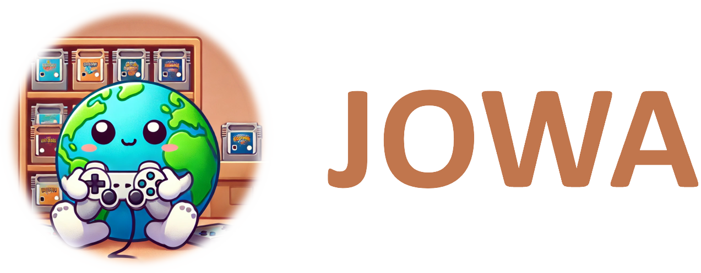

<div align="center">
   
</div>

---

Welcome to the official repository for our paper: "Scaling Offline Model-Based RL via Jointly-Optimized World-Action Model Pretraining".

**TL;DR:** A single JOWA-150M agent masters 15 Atari games at 84.7% human-level and 119.5% DQN-level, and can adapt to novel games with ~4 expert demos.

<div class="gallery">
    <div class="row">
      
      
      
      
      
    </div>
    <div class="row">
      
      
      
      
      
    </div>
    <p class="note">
      *Training used 84x84 grayscale images. RGB demos shown here for better visualization. For Atlantis (second in the first row),
        only the first 7 minutes of the 2-hour gameplay are displayed. More demos are <a href=static/mp4>here</a>.
    </p>
</div>
  
🚧 ***We are still updating and optimizing the code. Stay tuned for updates and additional resources!***

## 🚀 Installation

- python 3.8: `conda create -n jowa python=3.8 && conda activate jowa`
- Install basic dependencies for compatibility: `pip install setuptools==65.5.0 wheel==0.38.4 packaging pip==24.0`
- Install [other dependencies](requirements.txt): `pip install -r requirements.txt`
- (Optional but recommended) Install Flash-Attention: `pip install flash-attn --no-build-isolation`
- If evaluating, install jq to parse JSON files: `apt install jq`
- If training, set the wandb account: `wandb login`, `<API keys>`

## 📊 Eval

Download the model weights from [here](checkpoints/JOWA) or [google drive](https://drive.google.com/drive/folders/1YHaCemhobchJWE5zt28TUrKp2tp8yysF?usp=sharing).

Set hyperparameters of evaluation in `eval/eval.sh`, such as `model_name`, `game`, `num_rollouts`, and `num_gpus`. Then run this script:

```bash
bash eval/eval.sh
```

The above command will run the setting number of rollouts (episodes) in parallel. After completing all evaluation processes, get the aggregate scores using the following command:

```python
python eval/aggregate_scores.py --name JOWA_150M --env BeamRider
```

Reproduce results of all JOWA variants and baselines through the following command:

```python
python results/results.py
```

> [!NOTE]
> We found that some hyperparameters in a few groups of previous evaluation experiments (shown in the early version of paper) were set incorrectly. After the correction (already done in the current version of code), all JOWA variants achieved higher IQM HNS, and the scaling trend still holds. We will update the paper to show the corrected results.

## 🔧 Training
### Dataset for pretraining

1. Download raw dataset

```bash
python src/datasets/download.py
```

This will enable multi-process to download the original DQN-Replay dataset (~1TB for the default 20 games and 3.1TB for all 60 games).

2. Process and downsample data

```bash
python src/datasets/downsample.py
```

This command processes the raw data into two formats: **(i) Trajectory-level dataset:** Structured directory containing observations (.png files), rewards, actions, and terminals (.npy files) for each trajectory. Total size: ~0.6TB for the default 20 games. **(ii) Segment-level dataset:** CSV files containing segment indices in the correspoding trajectory.

During training, the `Dataset.__getitem__()` first indexes segments using the CSV file, then loads the actual segment data from the trajectory-level structured dir.

3. (Optional) Save segments in `.pkl` format to trading storage space (~8TB) for load time:

```bash
python src/dataset/save_segments_in_pkl.py
```

Rename the class function `__getitem_backup__` to `__getitem__` in the file `src/dataset.py` to enable the corresponding data loading way.

### Pretraining

```python
python src/pretrain.py hydra/job_logging=disabled hydra/hydra_logging=disabled
```

### Fine-tuning

```python
python src/fine_tune.py hydra/job_logging=disabled hydra/hydra_logging=disabled
```

> [!NOTE]
> The pre-training and fine-tuning codes are still being organized, due to lots of variable renaming.

## 📝 TODO

- \[x\] Release model weights.
- \[x\] Optimize evaluation code.
- \[x\] Optimize data preprocessing.
- \[ \] Merge and optimize pretraining & fine-tuning codes.
